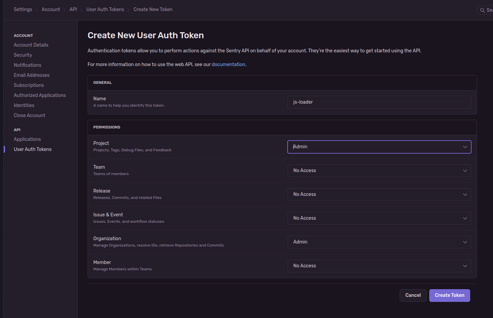

# Sentry Loader

This is a proof-of-concept project to tackle Javascript loader issue on Sentry (see this issue: https://github.com/getsentry/sentry/issues/22715).

## Installation

1. From your already set up self-hosted instance, go to http://your-sentry-instance.dev/settings/account/api/auth-tokens/new-token/ -- then generate a new token. Set Project and Organization permissions to "Admin". Then copy the token and save it somewhere safe.
   
2. On your `docker-compose.yml` file, add this additional container:
   ```yaml
   services:
     sentry-loader:
       <<: *restart_policy
       image: ghcr.io/aldy505/sentry-loader:edge
       environment:
         SENTRY_AUTH_TOKEN: "your auth token earlier"
         JS_SDK_VERSION: "8.4.0" # You can configure this one later on
         SENTRY_PUBLIC_HOSTNAME: "your-sentry-instance.dev" # Without http:// or https:// prefix. But provide ports if you're not using 80/443.
         USE_HTTPS: "false" # Set to true if you're using HTTPS on the "SENTRY_PUBLIC_HOSTNAME" earlier
   ```
3. On your `nginx/nginx.conf`, add these entries:
   ```nginx
   upstream loader {
      server sentry-loader:3000;
      keepalive 2;
   }
   
   server {
      listen 80;
      # The remaining config
   
      location ^/js-sdk-loader/ {
         proxy_pass http://loader;
      }
      location ^/8.4.0/ { # The value is from the `JS_SDK_VERSION` earlier
         proxy_pass http://loader;
      } 
      # You must put these before the `location /` block
      location / {
         proxy_pass http://sentry;
      }
   }
   ```
4. No need to re-run the `./install.sh` script. All you need to do is:
    ```bash
    sudo docker compose up -d sentry-loader nginx
    ```
   
There's all to it. You should be good to go.

## License

```
Copyright 2024 Reinaldy Rafli <aldy505@proton.me>

Licensed under the Apache License, Version 2.0 (the "License");
you may not use this file except in compliance with the License.
You may obtain a copy of the License at

   http://www.apache.org/licenses/LICENSE-2.0

Unless required by applicable law or agreed to in writing, software
distributed under the License is distributed on an "AS IS" BASIS,
WITHOUT WARRANTIES OR CONDITIONS OF ANY KIND, either express or implied.
See the License for the specific language governing permissions and
limitations under the License.
```

[See LICENSE](./LICENSE)